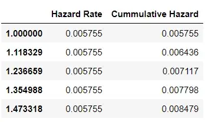

# Survival function

The survival function is denoted by S(t)
It shows the probability of a **subject surviving** (i.e., not experiencing the event) beyond time t. This is a non-increasing function.

# Hazard function

The hazard function, also known as the hazard rate, is denoted by h(t)
It shows the **instantaneous probability** of the event occurring at time t, given that the event has not already occurred. The hazard function can be derived from the survival function, and vice versa.

# Cumulative hazard function

The cumulative hazard function is a non-decreasing function that shows the **total accumulated risk of an event occurring at time t**. In mathematical terms, it is the area under the hazard function.

# Hazard Ratio

The hazard ratio is the **ratio of the hazard rate between two groups**. This is a quantified measure of **how a covariate affects the survival duration of the subjects in the study**.

# Picking the Right Model

Each model is unique in the terms of:

- ***assumptions*** they make
- ***information*** they provide

 4 that are most prominent: 
 the **Kaplan Meier** model
 the **Weibull** model
 the **Exponential** model
 the the **Cox Proportional-Hazards** model
 
 
# KAPLAN MEIER

##non-parametric model
 - meaning that it does not assume the distribution of the data.
 - generates a survival function with only the information provided.

##survival functions of different groups can be compared with the `log-rank test`, a non-parametric hypothesis test.

##It can not be used to compare **risk** between groups and compute metrics like the **hazard ratio**

#EXPONENTIAL

##parametric model
- meaning that it assumes that the data fits a specific distribution.
##The exponential model assumes that the hazard rate is constant.
- determine the hazard metrics:  hazard rate and the cumulative hazard function

Based on the output, the hazard rate remains constant, which is in line with the nature of the Exponential model.

Overall, the Exponential model provides substantial information on the survival function and the hazard function.

##Moreover, it can be used to compare the hazard rates of different groups.

However, it makes the strong assumption that the hazard rate is constant at any given time, which may not suit the time-to-event data of interest

# WEIBULL

##Parametric model
##Hazard Rate Linear
- The data distribution in the Weibull model is determined by the two parameters: λ and ρ.

- The λ parameter indicates how long it takes for 63.2% of the subjects to experience the event.

- The ρ parameter indicates whether the hazard rate is increasing, decreasing, or constant. If ρ is greater than 1, the hazard rate is constantly increasing. If ρ is less than 1, the hazard rate is constantly decreasing.

-  other words, the Weibull model assumes that the change in hazard rate is linear. The hazard rate can always increase, always decrease, or stay the same. However, the hazard rate can not fluctuate.

However, its results are based on the strong assumption that the hazard rate changes linearly across time, which may not suit the time-to-event data in question.

#Cox Proportional-Hazards Model

##Although the Exponential model and the Weibull model can evaluate covariates, they can only examine each covariate individually.

If the goal is to conduct a survival analysis that examines time-to-event data with respect to **multiple variables** at once, the Cox Proportional-Hazards model (also known as the Cox model) can be the preferable alternative.

The Cox model allows the hazard rate to fluctuate, as opposed to the parametric models where the hazard rate adheres to a fixed pattern.

The model is, however, dependent on the **proportional hazards assumption**. It assumes that the **hazard ratios between groups remain constant**. In other words, no matter how the hazard rates of the subjects change during the period of observation, the hazard rate of one group relative to the other will always stay the same.

In addition, the Cox model can quantify the strength of the relationships between the covariates and the survival duration of the subjects with survival regression. The summary method in the lifelines module shows the results of the regression.

The output provides a lot of information, but the greatest insights can be obtained with the exp(coef) column and the p column (p-value).

The p-value indicates which covariates have a significant effect on the survival duration. Based on the results, the fin, age, and prio covariates are statistically significant predictors for determining survival duration, given their coefficient’s small p-values.

Moreover, the hazard ratio for each covariate is equivalent to e to the power of the covariate’s coefficient (eᶜᵒᵉᶠ), which is already provided in the exp(coef) column.

**As an example, the eᶜᵒᵉᶠ value of the fin covariate, which represents financial aid, is 0.68. This means that being getting financial aid changes the hazard rate by a factor of 0.68 (i.e., a 32% decrease).**
Cela signifie que le fait de recevoir une aide financière modifie le taux de risque d’un facteur de 0,68 (soit une diminution de 32 %)

Of course, the Cox model is only suitable if its assumption of proportional hazards befits the time-to-event data. To justify the use of the model, one can test this assumption using the check_assumptions method

https://towardsdatascience.com/a-guide-to-model-selection-for-survival-analysis-2500b211c733#:~:text=the%20subsequent%20analysis.-,Popular%20Models%20in%20Survival%20Analysis,the%20Cox%20Proportional%2DHazards%20model.